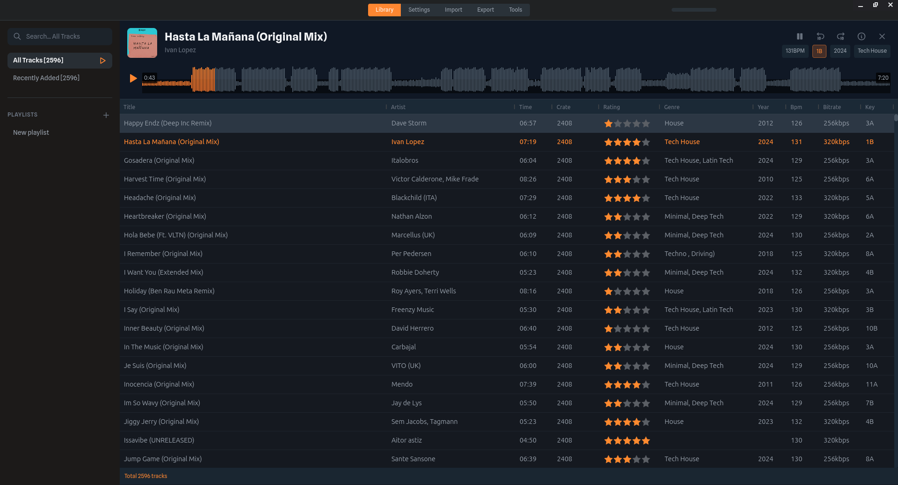
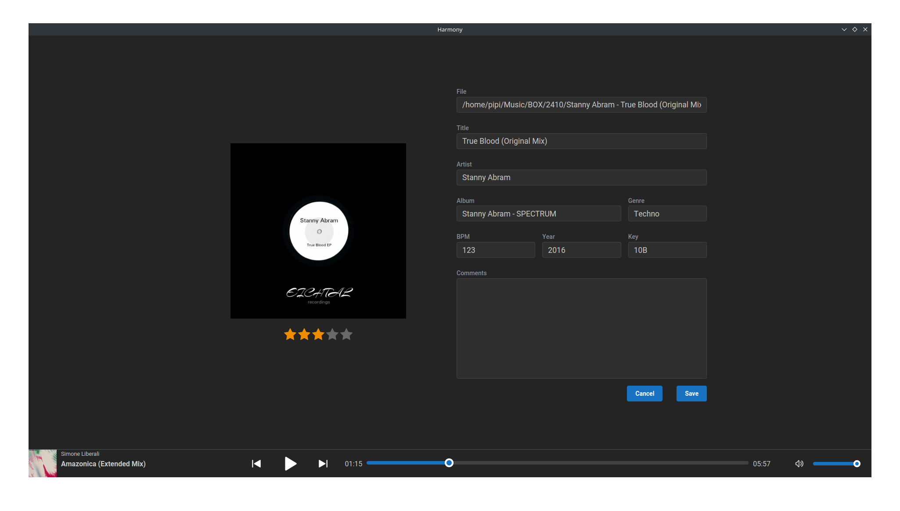
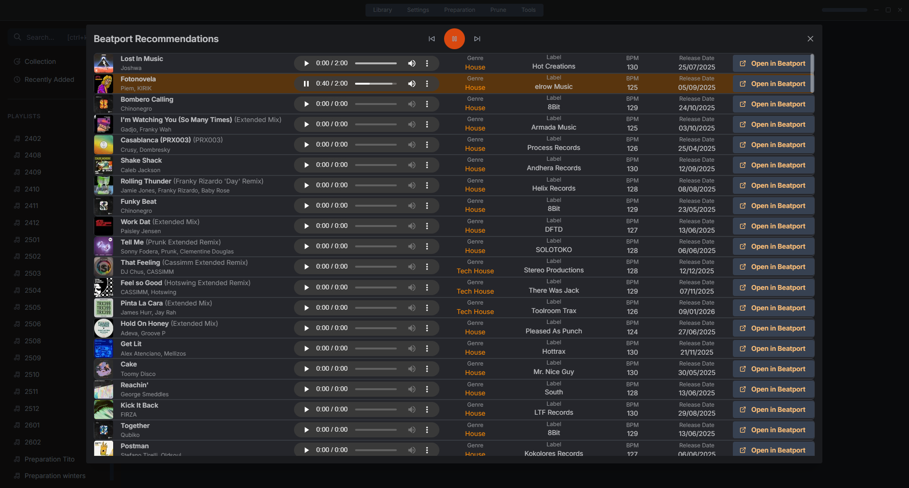

# Harmony

[](https://github.com/jvegaf/harmony/actions/workflows/build.yml)

## Description

Harmony is a music manager designed specifically for old-school DJs. It allows you to organize and manage your music collection efficiently.

## Features

- 🎵 Easy music management with automated tasks
- 📋 Playlist creation and organization
- ⚡ **High-performance drag & drop** - Instant track reordering (< 10ms)
- 🎨 Custom drag ghost showing track information
- 🔄 Automatic background synchronization
- 🔗 **Track URLs** - Store and access track pages from Beatport, Traxsource, and Bandcamp
- 🎧 Intuitive interface designed for DJs

## Screenshots

<details>
<summary><b>📸 Click to view screenshots</b></summary>

### Main Library View

Manage your entire music collection with powerful search and filtering capabilities.



### Track Detail View

Edit track metadata, find tag candidates from Beatport/Traxsource/Bandcamp, replace files, and manage ratings.


### Duplicate Finder

Identify and manage duplicate tracks in your collection with advanced comparison tools.



### Beatport Recommendations

Get track recommendations from Beatport



</details>

## Tech Stack

- **Desktop Framework**: Electron with TypeScript
- **Frontend**: React 18 + Vite + Mantine UI
- **State Management**: Zustand
- **Database**: Drizzle ORM + SQLite (better-sqlite3)
- **Build Tools**: electron-vite, electron-builder
- **Package Manager**: npm

## Recommended IDE Setup

- [VSCode](https://code.visualstudio.com/) + [ESLint](https://marketplace.visualstudio.com/items?itemName=dbaeumer.vscode-eslint) + [Prettier](https://marketplace.visualstudio.com/items?itemName=esbenp.prettier-vscode)

## Project Setup

### Install

```bash
npm install
```

### Development

```bash
npm run dev             # Start development mode with hot reload
npm start               # Preview built app
```

### Build

```bash
# For windows
npm run build:win

# For macOS
npm run build:mac

# For Linux
npm run build:linux

# Current platform
npm run build

# Production release
npm run release
```

### Code Quality

```bash
npm run lint            # ESLint with auto-fix
npm run format          # Prettier auto-format all files
npm run typecheck       # Run both node + web type checks
```

### Testing

```bash
npm test                # Run tests in watch mode
npm run test:run        # Run all tests once (CI mode)
npm run test:ui         # Open Vitest UI
npm run test:coverage   # Run tests with coverage report
```

## Documentation

- **[AGENTS.md](AGENTS.md)** - Complete project documentation, code style, architecture, available skills
- **[.agents/skills/](,agents/skills/)** - Specialized AI skills for Electron, React, Mantine, Zustand, code review, and more

## Contributing

If you would like to contribute to Harmony, please follow these steps:

1. Fork the repository
2. Create a new branch (`git checkout -b feature-branch`)
3. Read [AGENTS.md](AGENTS.md) for code style guidelines, architecture notes, and best practices
4. Make your changes following the project conventions
5. Run `yarn lint` and `yarn typecheck` before committing
6. Commit your changes (`git commit -m 'Add new feature'`)
7. Push to the branch (`git push origin feature-branch`)
8. Open a pull request

### Code Style

- **Import organization**: Node/Electron built-ins → External packages → Internal modules → Relative imports
- **Formatting**: Run `yarn format` (Prettier with single quotes, 120 line width)
- **TypeScript**: Use interfaces for objects, type aliases for unions, avoid `any`
- **Logging**: Use `electron-log` in main/preload (never `console.*`)
- **Error handling**: Always log errors, use try-catch for async operations

See [AGENTS.md](AGENTS.md) for complete guidelines.

# License

This project is licensed under the MIT License. See the [LICENSE](LICENSE) file for details.
